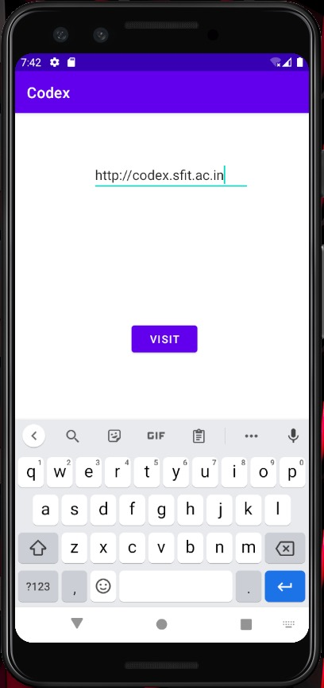
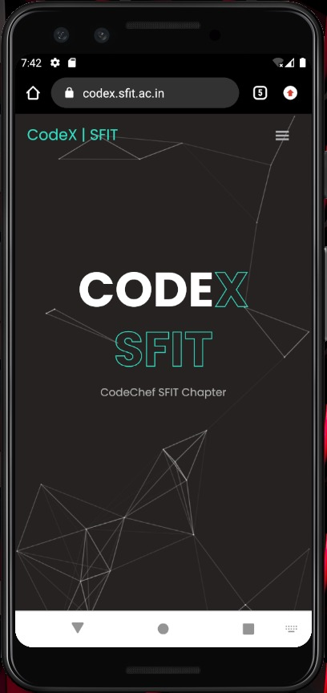

# Create a simple app to get familiar with the Workflow

   - [UserInterface](#userinterface)
      - [Add a text box](#add-a-text-box)
      - [Add a button](#add-a-button) 
   - [Main Activity](#main-activity)

## UserInterface
To get started, set up your workspace as follows:

- Create a new Android Project with a Empty Activity

- In the Project window, open ```app > res > layout > activity_main.xml.```
To make room for the Layout Editor, hide the Project window. To do so, select ```View > Tool Windows > Project```, or just click Project on the left side of the Android Studio screen.


### Add a text box
Follow these steps to add a Text-box:
- First, you need to remove what's already in the layout. Click TextView in the Component Tree panel and then press the Delete key.
- In the Palette panel, click Text to show the available text controls.
- Drag the Plain Text into the design editor and drop it near the top of the layout. This is an EditText widget that accepts plain text input.

### Add a Button
- In the Palette panel, click Buttons.
- Drag the Button widget into the design editor and drop it near the right side.
- Create a constraint from the left side of the button to the right side of the text box.

Now if you run your app, the textbox and Button will stick to the Top-Left corner as xml files comes with constraint layout by default and the text-box and button we added just now does not have any constraints attached to it

Now that the textbox and buttons are declared in the xml file add these constraints to the them with some margin 

For Text-Box
```xml
<!-- this is for margin -->
        android:layout_marginEnd="8dp"  
        android:layout_marginStart="8dp"  
        android:layout_marginTop="60dp"  
        android:ems="10"  
<!-- These are the constraints for the Text-box -->
        app:layout_constraintEnd_toEndOf="parent"  
        app:layout_constraintHorizontal_bias="0.575"  
        app:layout_constraintStart_toStartOf="parent"  
        app:layout_constraintTop_toTopOf="parent"
```

and for the buttons

```xml
<!-- this is for margin -->
        android:layout_marginRight="8dp"  
        android:layout_marginLeft="156dp"  
        android:layout_marginTop="172dp"
<!-- this is the text inside the Button -->
        android:text="Visit"  
<!-- These are the constraints for the Text-box -->
        app:layout_constraintEnd_toEndOf="parent"  
        app:layout_constraintHorizontal_bias="0.0"  
        app:layout_constraintStart_toStartOf="parent"  
        app:layout_constraintTop_toBottomOf="@+id/editText"
```

After all those Changes your ```activity_main.xml``` should look like this

```xml
<?xml version="1.0" encoding="utf-8"?>  
<android.support.constraint.ConstraintLayout xmlns:android="http://schemas.android.com/apk/res/android"  
    xmlns:app="http://schemas.android.com/apk/res-auto"  
    xmlns:tools="http://schemas.android.com/tools"  
    android:layout_width="match_parent"  
    android:layout_height="match_parent"  
    tools:context="example.javatpoint.com.implicitintent.MainActivity">  
  
    <EditText  
        android:id="@+id/editText"  
        android:layout_width="wrap_content"  
        android:layout_height="wrap_content"  
        android:layout_marginEnd="8dp"  
        android:layout_marginStart="8dp"  
        android:layout_marginTop="60dp"  
        android:ems="10"  
        app:layout_constraintEnd_toEndOf="parent"  
        app:layout_constraintHorizontal_bias="0.575"  
        app:layout_constraintStart_toStartOf="parent"  
        app:layout_constraintTop_toTopOf="parent" />  
  
    <Button  
        android:id="@+id/button"  
        android:layout_width="wrap_content"  
        android:layout_height="wrap_content"  
        android:layout_marginRight="8dp"  
        android:layout_marginLeft="156dp"  
        android:layout_marginTop="172dp"  
        android:text="Visit"  
        app:layout_constraintEnd_toEndOf="parent"  
        app:layout_constraintHorizontal_bias="0.0"  
        app:layout_constraintStart_toStartOf="parent"  
        app:layout_constraintTop_toBottomOf="@+id/editText" />  
</android.support.constraint.ConstraintLayout>  
```

## Main Activity
```java
package com.example.codexdemo;  

import android.content.Intent;  
import android.net.Uri;  
import android.support.v7.app.AppCompatActivity;  
import android.os.Bundle;  
import android.view.View;  
import android.widget.Button;  
import android.widget.EditText;  
  
public class MainActivity extends AppCompatActivity {  
    //Declaring variables for UI Elements
    Button button;  
    EditText editText;  
  
    //OnCreate Method is called when Activity is Created 
    @Override  
    protected void onCreate(Bundle savedInstanceState) {  
        super.onCreate(savedInstanceState); 

        //Setting the UI We made Before to this actvity
        setContentView(R.layout.activity_main); 
    
        //Variables are initialized to their UI Elements
        button = findViewById(R.id.button);  
        editText =  findViewById(R.id.editText);  
  
        //this methos is invoked whenever the button is pressed
        button.setOnClickListener(new View.OnClickListener() {  
            @Override  
            public void onClick(View view) { 
                //getting the value from text-box 
                String url=editText.getText().toString();  
                //viviting the website givin in the textbox
                Intent intent=new Intent(Intent.ACTION_VIEW, Uri.parse(url));  
                startActivity(intent);  
            }  
        });  
    }  
}  
```
## Sample Output



