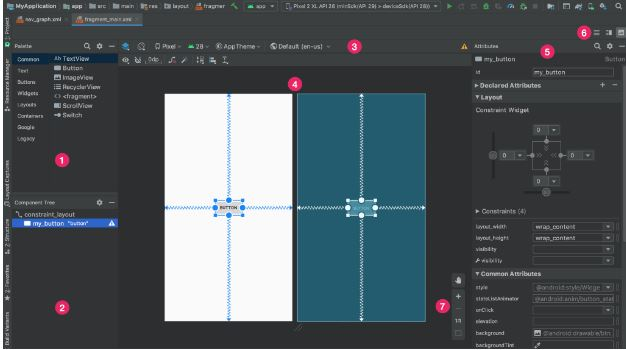
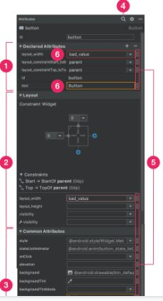

# UI Workflow
Parts:
   - [Layout Editor to auto-generate xml files:](#1-layout-editor-to-auto-generate-xml-files) 
        - [Find Items in the Palette](#find-items-in-the-palette)
        - [Edit the Attributes](#edit-view-attributes)
   - [Editing the XML](#2-editing-xml-files)
       
## 1. Layout Editor to auto-generate xml files:
  
  The Layout Editor enables you to quickly build layouts by dragging UI elements into a visual design editor instead of writing layout XML by hand. The design editor can preview your layout on different Android devices and versions, and you can dynamically resize the layout to be sure it works well on different screen sizes. 
   
   
 

- **Palette**: Contains various views and view groups that you can drag into your layout.
- **Component Tree**: Shows the hierarchy of components in your layout.
- **Toolbar**: Click these buttons to configure your layout appearance in the editor and change layout attributes.
- **Design editor**: Edit your layout in Design view, Blueprint view, or both.
- **Attributes**: Controls for the selected views attributes.
- **View mode**: View your layout in either Code , Design , or Split  modes. Split mode shows both the Code and Design windows at the same time.
- **Zoom and pan controls**: Control the preview size and position within the editor.

### Find items in the Palette
   To search for a view or view group by name in the Palette, click the Search  button at the top of the palette. Alternatively, you can type the name of the item whenever the Palette window has focus.
   You can find frequently used items in the Common category in the Palette. To add an item to this category, right-click on a view or view group in the Palette, and then click Favorite in the context menu.

### Edit view attributes
   You can edit view attributes from the Attributes window on the right side of the Layout Editor. This window is available only when the design editor is open, so be sure youre using either Design or Split mode to view your layout.
   When you select a view, whether by clicking the view in the Component Tree or in the design editor, the Attributes window shows the following. 
The Declared Attributes section lists attributes specified in the layout file. To add an attribute, click the Add  button at the top right of the section.
  

1. The Layout section contains controls for the width and height of the view. If the view is in a ConstraintLayout, this section also shows constraint bias and lists the constraints that the view uses. For more information on working with ConstraintLayout, see Build a Responsive UI with ConstraintLayout.
2. The Common Attributes section lists common attributes for the selected view. To see all available attributes, expand the All Attributes section at the bottom of the window.
3. Click the Search button to search for a specific view attribute.

4. The icons to the right of each attribute value indicate whether the attribute values are resource references. These indicators are solid  when the value is a resource reference and empty  when the value is hard-coded. These indicators help you recognize hard-coded values at a glance. Clicking indicators in either state opens the Resources dialog window where you can select a resource reference for the corresponding attribute.
5. A red highlight around an attribute value indicates an error with the value. An error might indicate an invalid entry for a layout-defining attribute, as shown in the red highlight in figure 3.
An orange highlight indicates a warning for the value. A warning might appear when you use a hard-coded value where a resource reference is expected, for example.

## 2. Editing xml files:

Using Androids XML vocabulary, you can quickly design UI layouts and the screen elements they contain, in the same way you create web pages in HTML — with a series of nested elements.
Each layout file must contain exactly one root element, which must be a View or ViewGroup object. Once youve defined the root element, you can add additional layout objects or widgets as child elements to gradually build a View hierarchy that defines your layout. For example, heres an XML layout that uses a vertical LinearLayout to hold a TextView and a Button:


**Sample XML file**
```xml
<?xml version="1.0" encoding="utf-8"?>
<LinearLayout xmlns:android="http://schemas.android.com/apk/res/android"
              android:layout_width="match_parent"
              android:layout_height="match_parent"
              android:orientation="vertical" >
    <TextView android:id="@+id/text"
              android:layout_width="wrap_content"
              android:layout_height="wrap_content"
              android:text="Hello, I am a TextView" />
    <Button android:id="@+id/button"
            android:layout_width="wrap_content"
            android:layout_height="wrap_content"
            android:text="Hello, I am a Button" />
</LinearLayout>

```

## Attributes
   Every View and ViewGroup object supports their own variety of XML attributes. Some attributes are specific to a View object (for example, TextView supports the textSize attribute), but these attributes are also inherited by any View objects that may extend this class. Some are common to all View objects, because they are inherited from the root View class (like the id attribute). And, other attributes are considered "layout parameters," which are attributes that describe certain layout orientations of the View object, as defined by that object's parent ViewGroup object.
## ID
   Any View object may have an integer ID associated with it, to uniquely identify the View within the tree. When the app is compiled, this ID is referenced as an integer, but the ID is typically assigned in the layout XML file as a string, in the id attribute. This is an XML attribute common to all View objects (defined by the View class) and you will use it very often. The syntax for an ID, inside an XML tag is:

 ```xml
    <Button android:id="@+id/my_button"/>
```   
- The at-symbol (@) at the beginning of the string indicates that the XML parser should parse and expand the rest of the ID string and identify it as an ID resource. The plus-symbol (+) means that this is a new resource name that must be created and added to our resources (in the R.java file). There are a number of other ID resources that are offered by the Android framework. 
- You can specify width and height with exact measurements, though you probably won't want to do this often. More often, you will use one of these constants to set the width or height:
wrap_content tells your view to size itself to the dimensions required by its content.
match_parent tells your view to become as big as its parent view group will allow.
- In general, specifying a layout width and height using absolute units such as pixels is not recommended. Instead, using relative measurements such as density-independent pixel units (dp), wrap_content, or match_parent, is a better approach, because it helps ensure that your app will display properly across a variety of device screen sizes.

