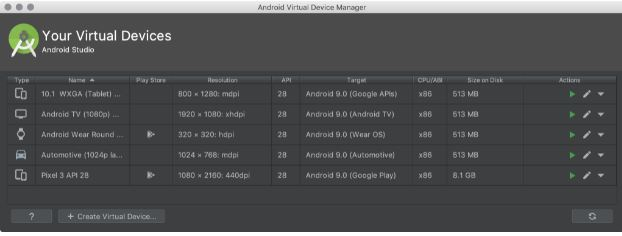

# Introduction
  - [Why make Native Android Apps](#why-make-native-android-apps)
  - [Creating a Android project](#creating-a-android-project)
  - [Import an existing project](#import-an-existing-project)
  - [Important files](#important-files)
  - [How to Add Dependencies](#how-to-add-dependencies)
  - [Final Step : How and Where to Run your App](#final-step--how-and-where-to-run-your-app)
  - [Run apps on a hardware device](#run-apps-on-a-hardware-device)

## Why make Native Android Apps

- Native Apps Have The Best Performance

  - With native mobile app development, the app is created and optimized for a specific platform. As a result, the app demonstrates an extremely high level of performance. Native apps are very fast and responsive because they are built for that specific platform and are compiled using platforms core programming language and APIs. As a result, the app is much more efficient. The device stores the app allowing the software to leverage the device’s processing speed. As users navigate through a native mobile app, the contents and visual elements are already stored on their phone which means load times are quick.

- Native Apps Are More Secure

  - Web apps rely on different browsers and underlying technologies such as JavaScript, HTML5, and CSS. Developing a native mobile app is a great way to guarantee your users reliable data protection.

- Native Apps Are More Interactive And Intuitive

  - Native mobile apps run much smoother regarding user input and output. These types of apps inherit their devices’ OS interfaces, making them look and feel like an integrated part of the device.
  - The most advantageous benefit to native mobile apps is the superior user experience. Native apps are created specifically for an operating system. They stick to the guidelines that ultimately enhance and align the user experience with the specific operating system. As a result, the flow of the app is more natural as they have specific UI standards for each platform. This allows the user to learn the app, such as deleting an element quickly. Adhering to specific guidelines eliminates the learning curve and allows users to interact with apps using actions and gestures they’re familiar with already.

- Native Apps Allow Developers To Access The Full Feature Set Of Devices
  - Native apps are developed for their particular platform, taking full advantage of the software and the operating systems’ features. These apps can directly access the hardware of the device such as the GPS, camera, microphone, etc. so they are faster in execution, which ultimately results in better user experience.

## Creating a Android Project

To create your new Android project, follow these steps:

1. Install the latest version of Android Studio.
2. In the Welcome to Android Studio window, click Create New Project.(If you have a project already opened, select File > New > New Project.)
3. In the Select a Project Template window, select Empty Activity and click Next
      
4. In the Configure your project window, complete the following:
  a. Enter "My First App" in the Name field.
  b. Enter "com.example.myfirstapp" in the Package name field.
  c. If you'd like to place the project in a different folder, change its Save location.
  d. Select Java from the Language drop-down menu.
  e. Select the lowest version of Android you want your app to support in the Minimum SDK field. (mostly people select android 4.4 because it is old enough to provide support  for maximum devices out there and is good enough for beginner apps but for advanced features selecting a higher version is advised)
     
5. Click Finish 
    
  

## Import an existing project

To import an existing, local project into Android Studio, proceed as follows:

1. Click **File > New > Import Project**.
2. In the window that appears, navigate to the root directory of the project you want to import.
3. Click **OK**.

Android Studio then opens the project in a new IDE window and indexes its contents.
If you are importing a project from version control, use the **File > New > Project** from **Version Control** menu.

Android Studio then opens the project in a new IDE window and indexes its contents.
If you are importing a project from version control, use the File > New > Project from Version Control menu.

## Important files 

- MainActivity.java

  - **app > java > com.example.myfirstapp > MainActivity**
  - This is the main activity. It's the entry point for your app. When you build and run your app, the system launches an instance of this Activity and loads its layout.

- Activity_main.xml
  - **app > res > layout > activity_main.xml**
  - This XML file defines the layout for the activity's user interface (UI).( It contains a TextView element with the text "Hello, World!" when creating a new project initiially )

## How to Add Dependencies

To add a dependency to your project, specify a dependency configuration such as “implementation” in the “dependencies” block of your “build.gradle” file.

**Importance of gradle.build file**

The Gradle build system in Android Studio makes it easy to include external binaries or other library modules to your build as dependencies. The dependencies can be located on your machine or in a remote repository.

## Final Step : How and Where to Run your App

To build and run your app, follow these steps:

1.  In the toolbar, select your app from the run configurations drop-down menu.
2.  From the target device drop-down menu, select the device that you want to run your app on.
    
3.  If you don't have any devices configured, then you need to either connect a device <a href="https://developer.android.com/studio/run/device#connect">via USB</a> or <a href="https://developer.android.com/studio/run/managing-avds#createavd">create an AVD</a> to use the <a href="https://developer.android.com/studio/run/emulator">Android Emulator</a>.
4.  Click **Run** 

## Run apps on the Android Emulator

The emulator provides almost all of the capabilities of a real Android device. You can simulate incoming phone calls and text messages, specify the location of the device, simulate different network speeds, simulate rotation and other hardware sensors, access the Google Play Store, and much more.

To open the AVD Manager, do one of the following:

- Select **Tools > AVD Manager**
- Click **AVD Manager** in the toolbar.

### Create an AVD

To create a new AVD :

1. Open the AVD Manager by clicking **Tools > AVD Manager**.
2. Click **Create Virtual Device**, at the bottom of the AVD Manager dialog.The **Select Hardware** page appears.
    
   
   
   Notice that only some hardware profiles are indicated to include **Play Store**. This indicates that these profiles are fully <a href="https://source.android.com/compatibility/cts/">CTS</a> compliant and may use system images that include the Play Store app.
3. Select a hardware profile, and then click **Next**.
4. If you don't see the hardware profile you want, you can create or import a hardware profile.

The **System Image** page appears.

 

Select the system image for a particular API level, and then click Next.

5. The **Recommended** tab lists recommended system images. The other tabs include a more complete list. The right pane describes the selected system image. x86 images run the fastest in the emulator.
   If you see **Download** next to the system image, you need to click it to download the system image. You must be connected to the internet to download it.
   The API level of the target device is important, because your app won't be able to run on a system image with an API level that's less than that required by your app, as specified in the <a href="https://developer.android.com/guide/topics/manifest/uses-sdk-element">minSdkVersion</a> attribute of the app manifest file. For more information about the relationship between system API level and minSdkVersion, see <a href="https://developer.android.com/studio/publish/versioning">Versioning Your Apps</a>.
   If your app declares a <a href="https://developer.android.com/guide/topics/manifest/uses-library-element">uses-library</a> element in the manifest file, the app requires a system image in which that external library is present. If you want to run your app on an emulator, create an AVD that includes the required library. To do so, you might need to use an add-on component for the AVD platform; for example, the Google APIs add-on contains the Google Maps library.
   The **Verify Configuration** page appears.
   
   

   Change <a href="https://developer.android.com/studio/run/managing-avds#avdproperties">AVD properties</a> as needed, and then click Finish.
   Click **Show Advanced Settings** to show more settings, such as the skin.
   The new AVD appears in the **Your Virtual Devices** page or the Select Deployment Target dialog.

### Run apps on a hardware device

When building an Android app, it's important that you always test your app on a real device before releasing it to users. This page describes how to set up your development environment and Android device for testing and debugging over an Android Debug Bridge (ADB) connection.

### Run Your App on Your Device
Before you can start debugging on your device, decide if you want to connect the device to using a USB cable or Wi-Fi. Then do the following:
  On the device, open the **Settings app**, select **Developer options**, and then enable USB debugging (if applicable).

